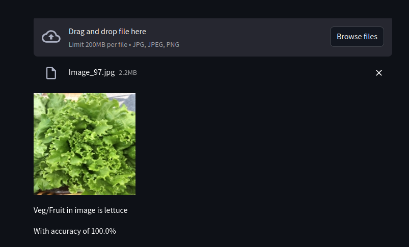

# Image classification


**Description**  
Voici une description de projet que vous pouvez utiliser pour votre projet de classification d'images avec CNN et Streamlit :
🔍 Image Classification Project with CNN

Description
Ce projet est une application de classification d'images utilisant un réseau de neurones convolutif (CNN) pour reconnaître et classer des images de fruits et légumes. Développée avec TensorFlow pour le modèle de machine learning et Streamlit pour l'interface utilisateur, cette application permet aux utilisateurs de télécharger une image et d'obtenir une prédiction de la catégorie de l'objet dans l'image.

L'objectif principal de ce projet est de démontrer l'usage des techniques de vision par ordinateur pour la classification d'images, en créant un modèle capable de distinguer plusieurs catégories d'images avec précision. Ce projet peut être utilisé comme base pour explorer davantage la vision par ordinateur et les réseaux de neurones dans un contexte d’application pratique.


## Project Structure
```bash
├── app.py
├── Image_classify.keras
├── Image_Class_Model.ipynb
├── image.png
├── README.md
└── requirements.txt
```

### 1. Clone the Repository
```bash
git clone https://github.com/youssefellouh/classification-image.git
cd classification-image 


```
### 2. Set Up a Virtual Environment
```bash
   python3 -m venv .venv
source .venv/bin/activate 
```
### 3. Install Dependencies
``` bash
  pip install -r requirements.txt
```
### 4. run projete
``` bash
- run fichiere jupyter
- streamlit run app.py
```
